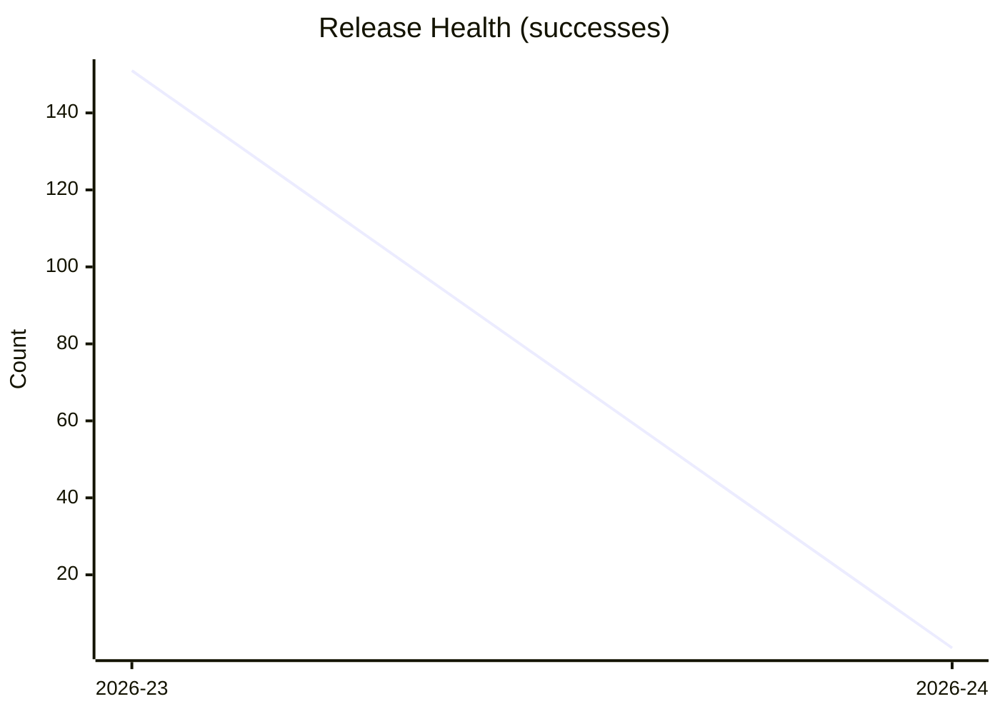

# taskpilot Progress Report — 2026-24
**Generated:** 2026-06-08 18:46 UTC

---

## KPI Summary

| KPI | 2026-24 | 2026-23 | Δ |
|---|---|---|---|
| Hours unsupervised (max gap) | — | — | — |
| Delivery lead time (avg days) | — | — | — |
| Review iterations per PR (avg) | — | — | — |
| Agent runs per task (avg) | 3.1 | 5.3 | — |
| Release health (ok/total) | 1/1 | 151/167 | — |
| Sessions per day (week total) | 34 | 78 | -44 ▼ |

---

## KPI Trends

### Hours Unsupervised (max gap per week)

```mermaid
xychart-beta
    title "Hours Unsupervised"
    x-axis ["2026-23", "2026-24"]
    y-axis "Hours"
    line [0, 0]
```

### Delivery Lead Time (average days)

```mermaid
xychart-beta
    title "Delivery Lead Time"
    x-axis ["2026-23", "2026-24"]
    y-axis "Days"
    line [0, 0]
```

### Review Iterations per PR (weekly average)

```mermaid
xychart-beta
    title "Review Iterations per PR"
    x-axis ["2026-23", "2026-24"]
    y-axis "Iterations"
    line [0, 0]
```

### Agent Runs per Task (weekly average)

```mermaid
xychart-beta
    title "Agent Runs per Task"
    x-axis ["2026-23", "2026-24"]
    y-axis "Runs"
    line [5.3, 3.1]
```

### Release Health (successes per week)



### Sessions per Day (weekly total spawns)

```mermaid
xychart-beta
    title "Sessions per Day"
    x-axis ["2026-23", "2026-24"]
    y-axis "Spawns"
    line [78, 34]
```

---

## Incidents

*Extracted from nanny-journal.md.*

_No journal entries found._

---

## Bootstrap KPI — Tasks Delivered vs Escalations per Day

*Tasks delivered = PRs merged that day. Escalations = `human` / `human->nanny` journal entries.*

| Date | Tasks Delivered | Escalations Handled |
|---|---|---|

_No historical data available._
