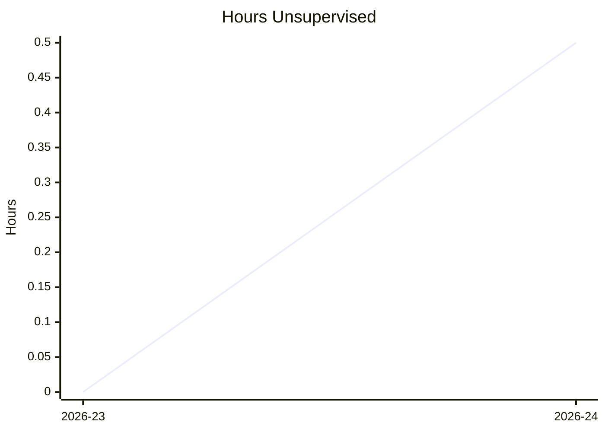
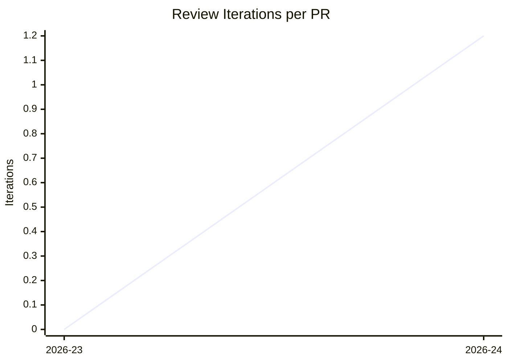
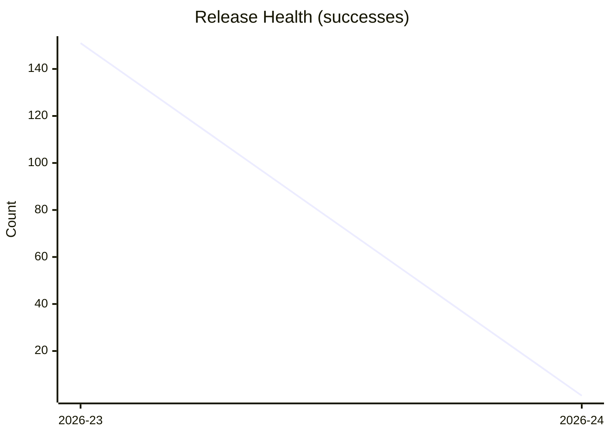
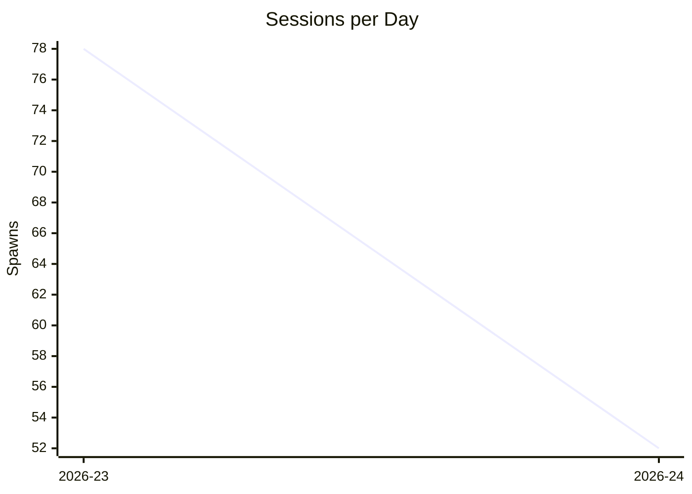

# taskpilot Progress Report — 2026-24
**Generated:** 2026-06-08 22:01 UTC

---

## KPI Summary

| KPI | 2026-24 | 2026-23 | Δ |
|---|---|---|---|
| Hours unsupervised (max gap) | 0.5h | — | — |
| Delivery lead time (avg days) | 0.0 | — | — |
| Review iterations per PR (avg) | 1.2 | — | — |
| Agent runs per task (avg) | 2.7 | 5.3 | — |
| Release health (ok/total) | 1/1 | 151/167 | — |
| Sessions per day (week total) | 52 | 78 | -26 ▼ |

---

## KPI Trends

### Hours Unsupervised (max gap per week)



### Delivery Lead Time (average days)

```mermaid
xychart-beta
    title "Delivery Lead Time"
    x-axis ["2026-23", "2026-24"]
    y-axis "Days"
    line [0, 0.0]
```

### Review Iterations per PR (weekly average)



### Agent Runs per Task (weekly average)

```mermaid
xychart-beta
    title "Agent Runs per Task"
    x-axis ["2026-23", "2026-24"]
    y-axis "Runs"
    line [5.3, 2.7]
```

### Release Health (successes per week)



### Sessions per Day (weekly total spawns)



---

## Incidents

*Extracted from nanny-journal.md.*

- `2026-06-08 22:10` `[human->nanny]` Operator authenticated Vercel CLI (`npx vercel` login, whoami=gzach) and directed nanny to wire Vercel before any merge | MIS-2 AC#3 (`verce
- `2026-06-08 22:12` From worktree ~/taskpilot-worktrees/mis-2: `vercel link --yes` -> gzachs-projects/mispel-deadline-tracker, `vercel --prod --yes` -> READY (h
- `2026-06-08 22:12` Did NOT flip MIS-2 -> Done despite all ACs met; left Needs Input | watcher dependency gate is status=Done; flipping Done while merges held w
- `2026-06-08 22:40` `[human->nanny]` Operator approved "merge the chain now" | unblock pilot feature backlog | none
- `2026-06-08 22:42` Merged PR#2 (MIS-2 scaffold) --squash --admin after resolving task-md add/add conflict via `taskpilot resolve-conflicts mis-2` | keystone me
- `2026-06-08 22:45` Resolved + merged PR#3 (MIS-3) --squash --admin. resolve-conflicts mis-3 needed 3 runs: aborted on untracked HANDOFF.md (manual git clean), 
- `2026-06-08 22:46` Verified MIS-3 AC#6 on main (npm install + npm run build EXIT=0, status.json present, 4 static pages); checked AC#6, set MIS-3 Done | merged
- `2026-06-08 22:47` Merged/confirmed PR#1 (MIS-1 breakdown) MERGED | foundational backlog metadata; merge-tree clean | none
- `2026-06-08 22:48` Closed PR#4 (duplicate strand) — reconcile reopened a PR from already-squash-merged tasks/back-mis-2; zero unique code. Branch left (deletio
- `2026-06-08 22:50` Watcher autonomously spawned + PR'd MIS-10 (PR#6) and MIS-11 (PR#5) once MIS-2 hit Done | loop working post-unblock; left for next review cy

---

## Bootstrap KPI — Tasks Delivered vs Escalations per Day

*Tasks delivered = PRs merged that day. Escalations = `human` / `human->nanny` journal entries.*

| Date | Tasks Delivered | Escalations Handled |
|---|---|---|
| 2026-06-08 | 4 | 2 |

> **Note:** xychart-beta renders only the last `line` in most mermaid versions — chart below shows escalations only; see table above for delivered tasks.

```mermaid
xychart-beta
    title "Tasks Delivered vs Escalations per Day"
    x-axis ["2026-06-08"]
    y-axis "Count"
    line [4]
    line [2]
```
